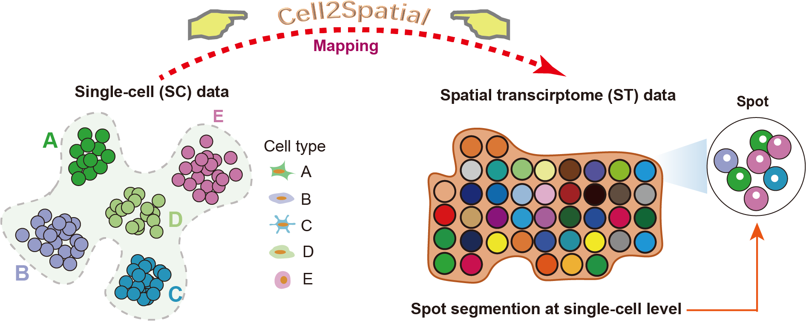

# Cell2Spatial
Cell2Spatial is a sophisticated tool designed to decode spatial transcriptomic spots at the individual cell level. It aligns single-cell data with spatial coordinates. It's crucial that the single-cell and spatial transcriptomic data match in tissue origin or major cell type representation to ensure accurate alignment, maximizing the tool's practical applications.

<p align="center">
	
</p>

In this tutorial, we'll showcase the installation and usage of Cell2Spatial, allowing precise interpretation of spatial transcriptomic spots at a single-cell granularity.

## 1. Essential dependencies

The Cell2Spatial's code comprises both R and Python components, necessitating essential dependencies.
* Python3:
	* Numpy
	* Scipy
	* Pandas
* R (>= 4.0):
	* reticulate
	* Seurat

## 2. Installation
``` r
library(devtools)
install_github("lihuamei/Cell2spatial")

```
## 3. Loading the packages and datasets (scRNA-seq and ST data)
``` r
library(Cell2spatial)
library(Seurat)
library(dplyr)
library(ggplot2)

sp.obj <- system.file("data", "Kindney_SP.RDS", package = "Cell2Spatial") %>% readRDS(.)
sc.obj <- system.file("data", "Kindney_SC.RDS", package = "Cell2Spatial") %>% readRDS(.)
sce <- runMap2SP(sp.obj, sc.obj, ctype = "subclass", res = 0.8, group.size = 30)

```

# Set parameters
|**Parameters**|**Description**                      |
|----------|-----------------------------------------|
|sp.obj     |Seurat object of spatial transcriptome (ST) data.|
|sc.obj  |Seurat object of single-cell (SC) data.|
|sc.markers  |A list of markers for cell types. If not provided, automated inference is performed using the modified Shannon-entropy method. Default: NULL.|
|ctype |Specify the column name for the cell type in meta.data slot of the SC Seurat object. Default: idents.|
|group.size|Specify the marker size for each subset derived from single-cell data. This information is crucial for estimating the activity of markers within each cell type. Default: 30.|
|res|Resolution for clustering ST spot. Default: 0.8.|
|duplicated|Assigning individual cells to ST coordinates with duplicated or not. Default: FALSE.|
|min.cells.of.subset|Include cells detected in at least one cell type in the SC data. Default: 5.|
|max.cells.in.spot|Maximum number of cells in ST spots. Default: 10 (for 10x Visium).|
|fix.cells.in.spot|Fixed number of cells assigned to a spot. Default: NULL.|
|n.features|Top k features used for integrating SC and ST data. Default: 3000.|
|knn|Top k nearest spots. Default: 5.|
|sample.size|Down-sampling a small subset of SC data for mapping to ST coordinates. Default: NULL.|
|select.markers|Method for selecting cell-type specific markers when 'sc.markers = NULL': modified Shannon-entropy strategy (shannon) or Wilcoxon test (wilcox) implemented by the Seurat package. Default: shannon.|
|dist.method|Measure the distance between single-cell and spots, maximum likehood model (mle) or correlation (cor). Default: mle.|
|return.type|Assigned results can be of the object type Seurat or SingleCellExperiment. Default: Seurat.|
|n.wrokers|Number of cores for parallel processing. Default: 4.|
|verbose|Show running messages or not. Default: TRUE.|

