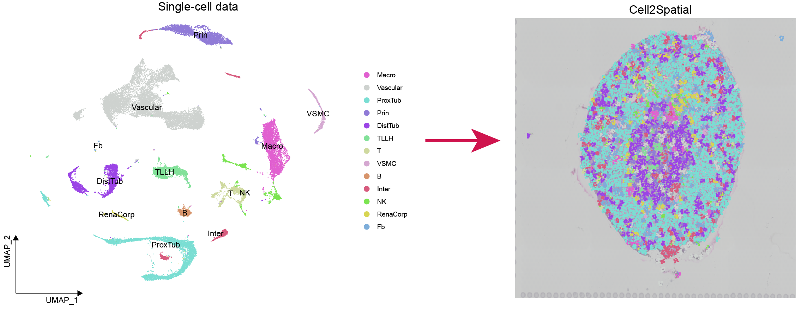

# Cell2Spatial
Cell2Spatial is a sophisticated tool specifically designed for decoding spatial transcriptomic spots at the individual cell level. Ensuring accurate alignment and maximizing practical applications necessitates a match in tissue origin or major cell type representation between single-cell and spatial transcriptomic data.
<p align="center">
	
</p>

In this tutorial, we'll showcase the installation and usage of `Cell2Spatial`, allowing precise interpretation of spatial transcriptomic spots at a single-cell granularity.

## 1. Essential dependencies

The Cell2Spatial's code comprises both `R` and `Python` components, necessitating essential dependencies as following tables.
* **Python (v3.8.17)**

| **Package**      | keras  | lapjv   | numpy   | pandas  | scikit_learn | tensorflow |
| :----------------: | :------: | :-------: | :-------: | :-------: | :------------: | :----------: |
| **Version**      | 2.13.1 | 1.3.24  | 1.24.3  | 2.0.3   | 1.3.2        | 2.13.1     |

* **R (v4.4.1)**

| **Package**      | Seurat  | SeuratObject   | reticulate | sctransform  | MatrixGenerics | UCell | glmGamPoi |
| :----------------: | :------: | :-------: | :-------: | :------: | :------------: | :----------: | :----: |
| **Version**      | 4.3.0 | 4.1.3 | 1.38.0 | 0.4.1 | 1.16.0 | 2.8.0 | 1.16.0 |

## 2. Installation

**(1).** `Python3` must be installed and configured in the environment for use with `reticulate`. Additionally, dependencies for `Python` libraries can be installed using the following command:

``` bash
pip install -r requirements.txt 

```

**(2).** Installing Cell2Spatial package

``` r
library(devtools)
install_github("lihuamei/Cell2Spatial")

```
## 3. Loading the packages and datasets (including scRNA-seq and ST data)
- **10x Visium low-resolution spatial data of mouse kindney as an exmaple**
``` r
library(Cell2Spatial)
library(Seurat)
library(dplyr)
library(randomcoloR)
library(tidydr)
```
``` r
sp.obj <- system.file("data", "Kindney_SP.RDS", package = "Cell2Spatial") %>% readRDS(.)
sc.obj <- system.file("data", "Kindney_SC.RDS", package = "Cell2Spatial") %>% readRDS(.)

```

## 4. Assigning single cells to spatial spots for reconstructing tissue architectures
```r
sce <- runCell2Spatial(sp.obj, sc.obj, cell.type.column = "mainCtype", resolution = 0.8, fix.cells.in.spot = 10)

```
---
**Note**
- **Cell Data Configuration:** When working with low-resolution ST data, setting the maximum number of cells per spot (`max.cells.in.spot`) allows Cell2Spatial to automatically estimate the cell count for each spot. This strategy helps ensure the inferred cell number closely aligns with the actual number in the tissue slice. Alternatively, you can set a fixed cell count per spot (`fix.cells.in.spot`) to more clearly observe the spatial distribution of different cell types in the tissue.
- **Non-matching Samples:** You can configure the `hotspot.detection.threshold` (range: 0-1, with a significance level of 0.05) to detect hot spots corresponding to different cell types and filter out spots that do not contain any cell types from the SC dataset. This helps address cases of unmatched data. For perfectly matched samples, setting the `hotspot.detection.threshold` to 1 allows for a better visualization of the reconstructed spatial architecture.

### 5. Visualization of mapping results.

``` r
sc.obj <- SCTransform(sc.obj, ncells = 3000, verbose = FALSE) %>%
    RunPCA(verbose = FALSE) %>%
    RunUMAP(dims = 1 : 30, verbose = FALSE)
```
``` r
set.seed(2023063)
cell.colors <- randomcoloR::distinctColorPalette(length(unique(sc.obj$mainCtype)))  %>% `names<-`(unique(sc.obj$mainCtype))
gp1 <- SpatialPlot(sce, group.by = 'Cell2Spatial', pt.size.factor=0.6, cols = cell.colors, image.alpha = 0.5, stroke = NA)
gp2 <- DimPlot(sc.obj, label = TRUE, cols = cell.colors) + theme_dr(xlength = 0.2, ylength = 0.2, arrow = grid::arrow(length = unit(0.1, "inches"), ends = 'last', type = "closed")) + theme(panel.grid = element_blank())
gp1 + gp2
```
<p align="center">
	
</p>

## 6. Session infos
```r
> sessionInfo()
R version 4.4.1 (2024-06-14)
Platform: x86_64-pc-linux-gnu
Running under: Ubuntu 22.04.2 LTS

Matrix products: default
BLAS:   /usr/lib/x86_64-linux-gnu/openblas-pthread/libblas.so.3
LAPACK: /usr/lib/x86_64-linux-gnu/openblas-pthread/libopenblasp-r0.3.20.so;  LAPACK version 3.10.0

locale:
[1] C

time zone: Asia/Chongqing
tzcode source: system (glibc)

attached base packages:
[1] stats     graphics  grDevices utils     datasets  methods   base

other attached packages:
 [1] Cell2Spatial_1.0.1  wrMisc_1.15.0.3     MuSiC_1.0.0
 [4] TOAST_1.18.0        quadprog_1.5-8      limma_3.60.3
 [7] EpiDISH_2.20.0      nnls_1.5            CARD_1.1
[10] Biobase_2.64.0      BiocGenerics_0.50.0 ggpubr_0.6.0
[13] reticulate_1.38.0   ggplot2_3.5.1       tidyr_1.3.1
[16] dplyr_1.1.4         SeuratObject_4.1.3  Seurat_4.3.0
[19] devtools_2.4.5      usethis_2.2.3

loaded via a namespace (and not attached):
  [1] fs_1.6.4                    matrixStats_1.3.0
  [3] spatstat.sparse_3.1-0       sf_1.0-16
  [5] httr_1.4.7                  RColorBrewer_1.1-3
  [7] doParallel_1.0.17           profvis_0.3.8
  [9] tools_4.4.1                 sctransform_0.4.1
 [11] backports_1.5.0             utf8_1.2.4
 [13] R6_2.5.1                    lazyeval_0.2.2
 [15] uwot_0.2.2                  urlchecker_1.0.1
 [17] withr_3.0.0                 sp_2.1-4
 [19] GGally_2.2.1                gridExtra_2.3
 [21] progressr_0.14.0            quantreg_5.98
 [23] cli_3.6.3                   textshaping_0.4.0
 [25] spatstat.explore_3.2-7      scatterpie_0.2.3
 [27] labeling_0.4.3              spatstat.data_3.1-2
 [29] proxy_0.4-27                ggridges_0.5.6
 [31] pbapply_1.7-2               systemfonts_1.1.0
 [33] dbscan_1.2-0                MCMCpack_1.7-0
 [35] parallelly_1.37.1           sessioninfo_1.2.2
 [37] maps_3.4.2                  rstudioapi_0.16.0
 [39] generics_0.1.3              gtools_3.9.5
 [41] ica_1.0-3                   spatstat.random_3.2-3
 [43] car_3.1-2                   spdep_1.3-5
 [45] Matrix_1.7-0                fansi_1.0.6
 [47] S4Vectors_0.42.0            abind_1.4-5
 [49] lifecycle_1.0.4             carData_3.0-5
 [51] SummarizedExperiment_1.34.0 SparseArray_1.4.8
 [53] Rtsne_0.17                  glmGamPoi_1.16.0
 [55] grid_4.4.1                  promises_1.3.0
 [57] crayon_1.5.3                miniUI_0.1.1.1
 [59] lattice_0.22-6              cowplot_1.1.3
 [61] pillar_1.9.0                GenomicRanges_1.56.1
 [63] boot_1.3-30                 corpcor_1.6.10
 [65] future.apply_1.11.2         codetools_0.2-20
 [67] leiden_0.4.3.1              wk_0.9.1
 [69] glue_1.7.0                  ggfun_0.1.5
 [71] data.table_1.15.4           remotes_2.5.0
 [73] vctrs_0.6.5                 png_0.1-8
 [75] spam_2.10-0                 locfdr_1.1-8
 [77] RcppML_0.3.7                testthat_3.2.1.1
 [79] gtable_0.3.5                cachem_1.1.0
 [81] S4Arrays_1.4.1              mime_0.12
 [83] coda_0.19-4.1               survival_3.7-0
 [85] SingleCellExperiment_1.26.0 iterators_1.0.14
 [87] pbmcapply_1.5.1             units_0.8-5
 [89] fields_16.2                 statmod_1.5.0
 [91] ellipsis_0.3.2              fitdistrplus_1.1-11
 [93] ROCR_1.0-11                 mcmc_0.9-8
 [95] nlme_3.1-165                RcppAnnoy_0.0.22
 [97] GenomeInfoDb_1.40.1         rprojroot_2.0.4
 [99] irlba_2.3.5.1               KernSmooth_2.23-24
[101] colorspace_2.1-0            spData_2.3.1
[103] DBI_1.2.3                   UCell_2.8.0
[105] tidyselect_1.2.1            compiler_4.4.1
[107] BiocNeighbors_1.22.0        SparseM_1.84
[109] desc_1.4.3                  DelayedArray_0.30.1
[111] plotly_4.10.4               scales_1.3.0
[113] classInt_0.4-10             lmtest_0.9-40
[115] NMF_0.27                    stringr_1.5.1
[117] digest_0.6.36               goftest_1.2-3
[119] spatstat.utils_3.0-5        XVector_0.44.0
[121] htmltools_0.5.8.1           pkgconfig_2.0.3
[123] MatrixGenerics_1.16.0       fastmap_1.2.0
[125] rlang_1.1.4                 htmlwidgets_1.6.4
[127] UCSC.utils_1.0.0            shiny_1.8.1.1
[129] farver_2.1.2                zoo_1.8-12
[131] jsonlite_1.8.8              BiocParallel_1.38.0
[133] magrittr_2.0.3              GenomeInfoDbData_1.2.12
[135] s2_1.1.6                    dotCall64_1.1-1
[137] patchwork_1.2.0             munsell_0.5.1
[139] Rcpp_1.0.12                 stringi_1.8.4
[141] brio_1.1.5                  zlibbioc_1.50.0
[143] MASS_7.3-61                 plyr_1.8.9
[145] pkgbuild_1.4.4              ggstats_0.6.0
[147] parallel_4.4.1              listenv_0.9.1
[149] ggrepel_0.9.5               deldir_2.0-4
[151] splines_4.4.1               tensor_1.5
[153] igraph_2.0.3                spatstat.geom_3.2-9
[155] ggsignif_0.6.4              rngtools_1.5.2
[157] reshape2_1.4.4              stats4_4.4.1
[159] pkgload_1.4.0               foreach_1.5.2
[161] tweenr_2.0.3                httpuv_1.6.15
[163] MatrixModels_0.5-3          RANN_2.6.1
[165] purrr_1.0.2                 polyclip_1.10-6
[167] future_1.33.2               scattermore_1.2
[169] gridBase_0.4-7              ggforce_0.4.2
[171] broom_1.0.6                 xtable_1.8-4
[173] e1071_1.7-14                ggcorrplot_0.1.4.1
[175] rstatix_0.7.2               later_1.3.2
[177] viridisLite_0.4.2           class_7.3-22
[179] ragg_1.3.2                  tibble_3.2.1
[181] registry_0.5-1              memoise_2.0.1
[183] IRanges_2.38.0              cluster_2.1.6
[185] globals_0.16.3              concaveman_1.1.0

```
